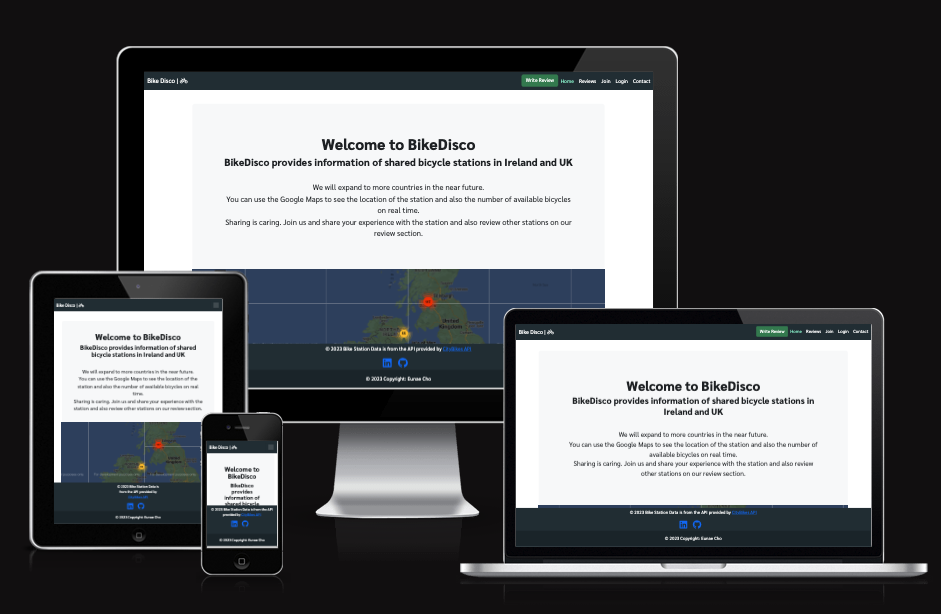
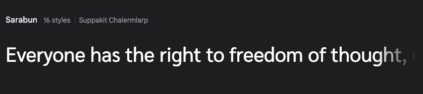
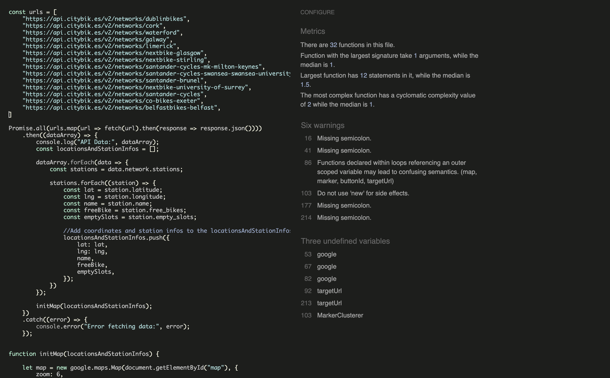

# BikeDisco


## Table of Content

1. About

# About

BikeDisco is a public bicycle station application that provides station locations and available number of bicycles on real time across Ireland and UK. Station information is all from [CityBike API](https://api.citybik.es/v2/#net_resource). User can join the website, review specific stations and contact us for feedback and improvements.

# Project Goals
- Give users real time information about the bicycle station in Ireland and UK.
- Enable users to write a review about specific stations and also view other reviews that were written by other users. 

## User Goal
- View into the shared bicycle stations in Ireland and UK on Google Maps.
- Create a review of each stations.
- Edit a review that has been created by themselves. 
- View other reviews that were posted by others.
- Delete their own reviews. 
- Join the website as a member. 
- Update their personal data such as name, email address, phone number etc. 
- Delete their account.
- Contact to the admin by filling out the given form.


# User Experience
## Target Audience
- People who likes to use the shared bicycle in Ireland and UK. 
- People who wants to know the real time information of bicycle stations in Ireland and UK.
- People who wants read/share experience after using the shared bicycle station. 

## User Expectations
- Application showing clear purpose.
- Easy interface that allows quick and efficient navigation.
- Interact with other users by 

## User Stories
- Dividied the user stories according to the sections; homepage, reviews, profile and contact.

### HOME PAGE

- Home page should be easy to understand what the website is going to service. It should have the below assets.

**Google Maps**

- Google Maps that consists the markers for the shared bike stations. 
- Google maps are the main asset for the home page.
- When the user clicks the station marker, the marker should show the info window that contains the name of the station and the available bike numbers.
- On the info window the user could click on a button to write a review of the station.
- If the user is unregistered then the button will ask them to sign in.
- As a registered user, the user should be able to write a review of the station.

**Top Link Bar**

- on the top-left hand side, the title of the website should be placed. The title links to the homepage.
- On the top-right hand side, the link bar should be placed. Link bar menus should look slightly different to the users who are unregistered and registered.
- As a unregistered user, the menu bar should have home, review, login, join and contact.
- As a registered user, the menu bar should have home, review, my pagem logout and contact.

### REVIEWS

- Reviews page will have every reviews written by registered users. The reviews will be shown in a descending order (new one first).
- When the user clicks the review, the full review will be shown on a modal.
- As a site user, I can enter reviews page so that I can read the written reviews.
- As a registered user, I can click 'write review' so that I can write a review.
- As a registered user also a review author, I can view and click edit/delete button, so that I can edit/delete my reviews.
- As an unregistered user, I can click on 'write review', so that I can be asked to sign in the website. 
- (good to have) As a registered user, I can filter the reviews according to the country and the city so that I can only see the reviews for the specific country or the city. - (good to have) - As a review author, I can select specific bike station so that I can write a review for the targeted station.

### PROFILE

- Profile is for registered users only. They could view their data such as user id, name, email address, phone number. They could edit their data and also delete their account. 
- As a registered user, I could see my id first name, last name, email address and the list of reviews that i have written.
- As a registered user, I could edit my first name, last name and email address, so that I can update it to a new data.
- (good to have) As a registered user, I could click my reviews, so that I can view/edit/delete the reviews.
- As a registered user, I could delete my account, so that I can leave from the registered user.
- As a registered user, I could change my password, so that I can secure my account.

### CONTACT

- Contact page will be the page for the user to contact the admin of the website to provide feedback or questions. 
- Anyone could write this form. 
- The actuale email sending function is not implemented yet since this project is not aiming for that, but the users will still get the alert message that saying 'Thank you for contacting us. We will get back to you soon.'
- As a site user, I can access Contact page and write down the form, so that I can reach out to the admin. 


# Design

## Font 

Using 'Sarabun' supplied by Google Font and sans-serif as a backup when the browser is not supporting Sarabun.

<details>
<summary>See font</summary>


</details>

# Database

## Data Models

### User Model
- User model is from Django allauth library and it contains basic information about authenticated user. 

### Post Model

| Name | Field Type | Validation |
| :---:   | :---: | :---: |
| title | CharField | max_length=200, unique=True |
slug | SlugField | max_length=200, unique=True |
author | ForeignKey | on_delete=models.CASCADE, related_name="review_posts" |
updated_on | DateTimeField | auto_now=True |
content | TextField | |
featured_image | CloudinaryField | 'image', default='placeholder' |
created_on | DateTimeField | auto_now_add=True |
status | IntegerField | choices=STATUS, default=1 |
country | CharField | max_length=100, null=True |
city | CharField | max_length=100, null=True |
station_name | CharField | max_length=100, null=True |

### Profile Model

| Name | Field Type | Validation |
| :---:   | :---: | :---: |
user | OneToOneField | on_delete=models.CASCADE, related_name='profile' |
firstname | CharField | max_length=50, blank=True, Default = 'Enter your first name' |
lastname | CharField | max_length=50, blank=True, Default = 'Enter your first name' |
phone_number | PhoneNumberField | blank=True |
email | EmailField | |

### Contact Model

| Name | Field Type | Validation |
| :---:   | :---: | :---: |
name | CharField | max_length=100 |
email | EmailField | |
subject | TextField | |


## Testing


## Validation

### HTML

- Conduncted every HTML codes on [The W3C Markup Validation Service](https://validator.w3.org/#validate_by_input)

- Ignored all error messages related about missing !DOCTYPE on the top since we are loading static.

- Every other errors were parse error related with Django template and Jinja2 so they were ignored as well.


### JavaScript

- Conducted [JShint](https://jshint.com/) validation check for script.js codes.



- Fixed serveral missing semicolon issues.

- Two warnings 
    - These will not be fixed since they are related with Google Maps JavaScript code. 
```
86	Functions declared within loops referencing an outer scoped variable may lead to confusing semantics. (map, marker, buttonId, targetUrl)
103	Do not use 'new' for side effects.
```

- Three undefined variables
    - These will not be fixed neither, since `google` and `MarkerClusterer` is both from Google Maps JavaScript code. 
    - `targetUrl` is under serachstation.html script, so will not be fixed in script.js file.
```
53	google
67	google
82	google
92	targetUrl
213	targetUrl
103	MarkerClusterer
```

### Python

- Conducted all py files on [CI Python Linter](https://pep8ci.herokuapp.com/)

- No errors were found. 


## WAVE (Accessibility check)

## Deployment 


## Credits and References

- [CityBikes API Documentation](https://api.citybik.es/v2/#net_resource)
- jQuery
- [Google Maps API](https://developers.google.com/maps/documentation/javascript)
- [Bootstrap 5.3.1](https://getbootstrap.com/docs/5.3/)
- [Django](https://www.djangoproject.com/)
    - [Django Allauto](https://django-allauth.readthedocs.io/en/latest/)
    - [django-active-link](https://valerymelou.com/blog/2020-05-04-how-to-highlight-active-links-in-your-django-website)
- [Google Font](https://fonts.google.com/)
- [Fontawesome](https://fontawesome.com/)
- [Stackoverflow](https://stackoverflow.com/) for browsing related questions