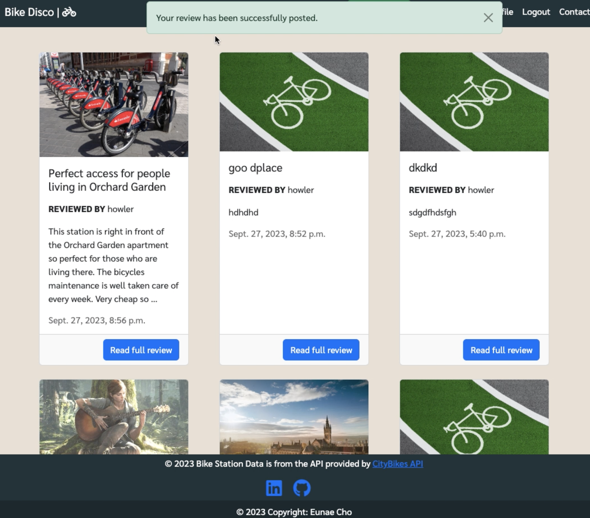
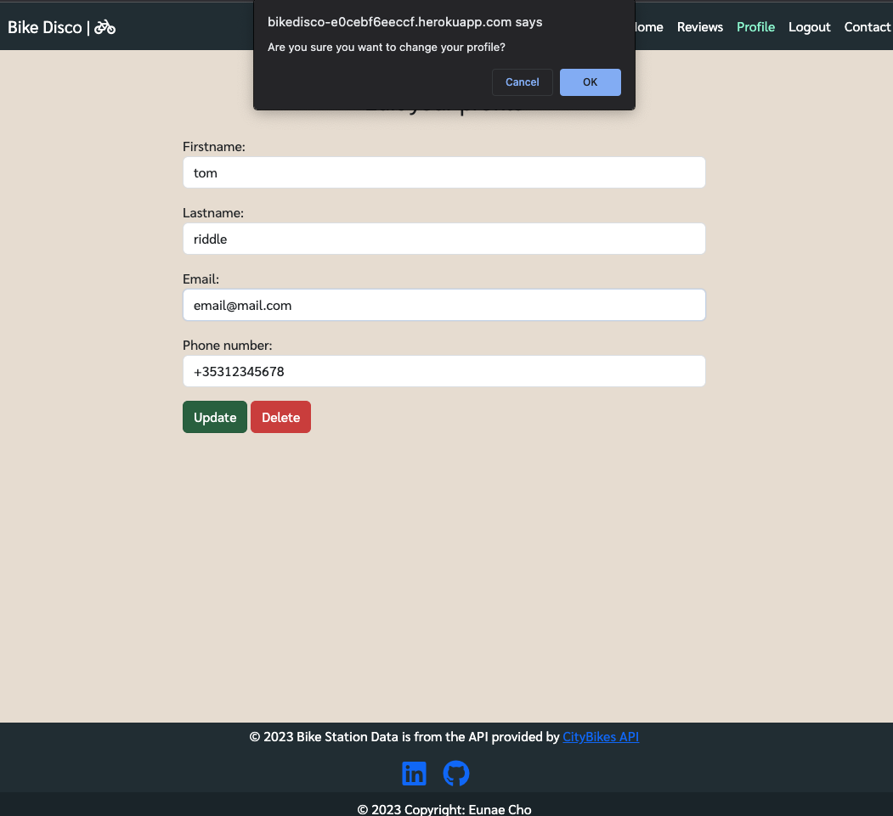

# BikeDisco


# About

BikeDisco is a public bicycle station application that provides station locations and available number of bicycles on real time across Ireland and UK. Station information is all from [CityBike API](https://api.citybik.es/v2/#net_resource). User can join the website, review specific stations and contact us for feedback and improvements.

# Project Goals
- Give users real time information about the bicycle station in Ireland and UK.
- Enable users to write a review about specific stations and also view other reviews that were written by other users. 

## User Goal
- View into the shared bicycle stations in Ireland and UK on Google Maps.
- Create a review of each stations.
- Edit a review that has been created by themselves. 
- View other reviews that were posted by others.
- Delete their own reviews. 
- Join the website as a member. 
- Update their personal data such as name, email address, phone number etc. 
- Delete their account.
- Contact to the admin by filling out the given form.


# User Experience
## Target Audience
- People who likes to use the shared bicycle in Ireland and UK. 
- People who wants to know the real time information of bicycle stations in Ireland and UK.
- People who wants read/share experience after using the shared bicycle station. 

## User Expectations
- Application showing clear purpose.
- Easy interface that allows quick and efficient navigation.
- Interact with other users by writing reviews and also adding comments on the reviews.

## User Stories

1. As a site user I want the navigation to be intuitive and user friendly so that I can navigate the app easily
2. As a site user I want to navigate through the Google Maps so that I can check the location of the bicycle station in Ireland and UK.
3. As a site user I want to check the avaiable number of bicycles on Google Maps info window.
4. As a site user I can join the website as an authenticated user. 
5. As a site user I can access Contact page so that I can contact the admin to provide my opinion or feedback of the website. 
6. As a site user I can access Reviews page so that I can read the reviews that were posted by authenticated users. 
7. As an authenticated user I can write review so that I can share my thoughts of the bicycle stations. 
8. As an authenticated user and a review author I can edit/delete the review that I have posted so that I can amend my reviews.
9. As an authenticated user I can login to the website. 
10. As an authenticated user I can write comments on the posted review modal so that I can share my thoughts of the review. 
11. As an authenticated user and a commenter I can delete my comment so that I can remove my thoughts about the review.
12. As an authenticated user I can access Profile page so that I can check my ID, email address, first name, last name and phone number. 
13. As an authenticated user I can access edit from Profile page so that I can change my first name, last name, email and phone number. 
14. As an authenticated user I can access Logout page so that I can log out from the site. 

## Site Owner Stories

1. As a site owner I can restrict sections of apps to unauthenticated users so that I can meet the basic data protection standards.
2. As a site owner I would like the authenticated users to have full access on using the apps on the website.
3. As a site owner I would like the site users to submit a contact form so that I can get feedbacks of the website.
4. As a site owner I would like that authenticated users have full access to CRUD(Create, Read, Update, Delete) functionalities when using the website. 


## Project Structure

### HOME PAGE

- Home page should be easy to understand what the website is going to service. It should have the below assets.

**Google Maps**

- Google Maps is currently using developer version since I do not have the paid account for using Google Maps API. Still the functions are working it is not a major blocker of using the site. 
- Google Maps that consists the markers for the shared bike stations. 
- Google maps is the main asset for the home page.
- When the user clicks the station marker, the marker should show the info window that contains the name of the station and the available bike numbers.
- On the info window the user could click on a button to write a review of the station.
- If unauthenticated user clicks the 'write review' button they will be brought to sign in page.

**Top Link Bar**

- On the top-left hand side, the title of the website should be placed. The title links to the homepage.
- On the top-right hand side, the link bar should be placed. Link bar menu should look slightly different to the users between unauthenticated and authenticated.
- As an unauthenticated user, the menu bar should have home, review, login, join and contact.
- As an authenticated user, the menu bar should have home, review, my page, logout and contact.

### REVIEWS

- Reviews page will have every reviews written by registered users. The reviews will be shown in a descending order (new one first).
- When the user clicks the review, the full review will be shown on a modal.


### PROFILE

- Profile is for registered users only. They could view their data such as user id, name, email address, phone number. They could edit their data and also delete their account. 


### CONTACT

- Contact page will be the page for the user to contact the admin of the website to provide feedback or questions. 
- Anyone could write this form. 
- The actual email sending function is not implemented yet since this project is not aiming for that, but the submitted form will be sent to the database and admin will be able to read it. 
- Also the users will still get the alert message that saying 'Thank you for contacting us. We will get back to you soon.'

### Join (Sign up), Login, Logout

- Joining the website as an authenticated user, login and logout features are all part of django-allauth library. The templates are under templates > account > login.html, logout.html and signup.html. These files are using extends function from my base.html to match with the main design of the website. 
- Steps to add django-allauth templates

    1. Install django allauth by entering the line on the terminal: `pip3 install django-allauth`
    2. Update my requirements.txt: pip3 `freeze --local > requirements.txt`
    3. Add the allauth url on bikedisco > urls.py
        `path('accounts/', include('allauth.urls')),`
    4. Go to settings.py and add allauth apps on INSTALLED_APPS

        `'django.contrib.sites',
        'allauth',
        'allauth.account',
        'allauth.socialaccount',`
    5. Set `SITE_ID = 1`
    6. Add redirection urls so that after user logged in all logged out site will redirect to the home page

       ` LOGIN_REDIRECT_URL = '/'
        LOGOUT_REDIRECT_URL = '/'`
    7. To prevent 500 errors during login and registertion add, 
        `ACCOUNT_EMAIL_VERIFICATION = 'none'`

    8. Migrate to the database 


## Code Structure

Project code structure is organised according to the various application using Django Framework. However, every html template is stored all together under templates > main folder.

- Bikedisco App: Serves as the basic structure delivery, aka home app. It consists settings.py for the project, and urls.py for the homepage and includes all other app urls. It also handles the error page as well.

- Contactus App: This app is for users to send a feedback or their opinion of the project to the site owner. It contains the model for Contact, form and views to see the Contact form.

- Profile App: This app is for the authenticated users to manage their account. It has the CRUD functionality for the users to read, update and delete their account. 

- Review App: This app contains full CRUD functionality for adding reviews and comments for authenticated user. It has two models; Post and Comment. Authenticated users can create, read, update and delete a review. Also they can create, read and delete comments.

## Other Django Apps

- settings.py: Contains all configuration settings for my Django project.

- Procfile: Specify the commands that should be executed when Django app is deployed on the hosting service. 

- static: css and js file is stored as well as the image files for the readme file. 

- requirements.txt: Lists all the dependencies required for the Django project to run. 

- env.py: Sensitive data such as API keys and SECRET key are stored here. My Google Maps API KEY is also stored here so that it would not be revealed even on the base.html code so that it could prevent potential attackers not fetch it from the developer's page. Maps API key is also added on my Environment Variables.

# CRUD Functionality 

## Review

Authenticated user has full CRUD functionality available for the review. User can write the review, read the review, edit the review and last but not least delete the review. 

### Create

Authenticated user can write review by clicking 'write review' from the top menu bar. 

Once they submit, an alert message will let them know your review has been added. 

<details>
<summary>See Review Submit Popup Screenshot</summary>



</details>

### Read

Authenticated user can read their review also other reviews that have been posted by other authenticated users. 

<details>
<summary>See Read Review Screenshot</summary>


</details>


### Update

Authenticated user can update/edit their own reviews. 

<details>
<summary>See Edit Review Popup Screenshot</summary>


</details>

### Delete

Authenticated user can delete their review. 

<details>
<summary>See Delete Review Popup</summary>


</details>


## Comment

Authenticated user can write, read and delete comments. 

#### Create

Authenticated user can write a comment on the review modal. 

<details>
<summary>See create Comment Screenshot</summary>


</details>

#### Read 

User can read comments on a review modal by clicking on the 'Read full review' on Reviews page. 

<details>
<summary>See Read Comment Screenshot</summary>


</details>


#### Delete

Commenter can delete their comments. Only the commenter will be able to see the trashcan icon next to their own comment on the review modal.


<details>
<summary>See delete comment popup screenshot</summary>


</details>


## Profile

User can create, read, update and delete their account.

#### Create

<details>
<summary>See Profile Create</summary>


</details>

#### Read

<details>
<summary>See Profile Read</summary>


</details>

#### Update

<details>
<summary>See Profile Edit</summary>



</details>

#### Delete

<details>
<summary>See Profile Delete</summary>


</details>

<details>
<summary>See Profile After Delete</summary>


</details>


# Design

## Color Scheme
Used light brown colour on the background to reduce stressed eye and dark theme on the nav and the footer for better visibility on the main content. 
Color scheme is from [Coolor](https://coolors.co/)

<details>
<summary>See Color Palette</summary>


</details>

## Font 

Using 'Sarabun' supplied by Google Font and sans-serif as a backup when the browser is not supporting Sarabun.

<details>
<summary>See font</summary>


</details>


# Database

## Data Models

5 models are used for each apps. 

### User Model
- User model is from Django allauth library and it contains basic information about authenticated user. 

### Post Model

- Post model is used for each review uploaded by the user. It has a foreign key for author which is extended by User model. It uses slug field to create a unique id for each review. Also country, city and the station_name data is fetched from the CityBike API which will be used to populate a dropdown menu for the user to select the station info when posting a review.

| Name | Field Type | Validation |
| :---:   | :---: | :---: |
| title | CharField | max_length=200, unique=True |
slug | SlugField | max_length=200, unique=True |
author | ForeignKey | on_delete=models.CASCADE, related_name="review_posts" |
updated_on | DateTimeField | auto_now=True |
content | TextField | |
featured_image | CloudinaryField | 'image', default='placeholder' |
created_on | DateTimeField | auto_now_add=True |
status | IntegerField | choices=STATUS, default=1 |
country | CharField | max_length=100, null=True |
city | CharField | max_length=100, null=True |
station_name | CharField | max_length=100, null=True |


### Comment Model

- Comment model is used for comments on each review modal. Two foreign key; post and user is used to be linked with the Post and User models. 

| Name | Field Type | Validation |
| :---:   | :---: | :---: |
| post | ForeignKey | Post, on_delete=models.CASCADE, related_name='comment' |
| user | ForeignKey | User, on_delete=models.CASCADE, related_name='commentuser', null=True |
| comment | TextField | |
| created_on | DataTimeField | auto_now_add=True |

### Profile Model

- Profile model is used for authenticated user's profile data. 

| Name | Field Type | Validation |
| :---:   | :---: | :---: |
user | OneToOneField | on_delete=models.CASCADE, related_name='profile' |
firstname | CharField | max_length=50, blank=True, Default = 'Enter your first name' |
lastname | CharField | max_length=50, blank=True, Default = 'Enter your first name' |
phone_number | PhoneNumberField | blank=True |
email | EmailField | |

### Contact Model

- Contact Model is used to populate the Contact form on Contact model. These data will be stored in our database when the user submits the contact form. 

| Name | Field Type | Validation |
| :---:   | :---: | :---: |
name | CharField | max_length=100 |
email | EmailField | |
subject | TextField | |


## API

### CityBike API

- The main content which is providing real time data and location of the bicycle stations is coming from CityBike API. This API is a free service providing shared bicycle station data across various of countries. URL for each city could be found at the href on the API. See the steps taken to get the URL for each city with the below example.

1. Go to http://api.citybik.es/v2/networks
2. Search for the city name that you want to use (e.g. Cork)
3. Check the href of that city. (e.g. "href":"/v2/networks/cork")
4. Copy the href and add it on the end of the main URL (e.g. http://api.citybik.es/v2/networks/v2/networks/cork)
5. Access the above URL and copy/paste it on the beautify website to navigate into the API (e.g. [JSON Formatter](https://jsonformatter.org/))


### Google Maps API

- This project is using Google Maps JavaScript API. My API code is being hidden in the env.py file and will not be sent over to Github since I have added the env.py file to be ignored (.gitignore).  
- Google Maps are not paid version so it will show unwanted water marks on the background of the map and a popup message on the top. Despite that, all the expected functions that I have implemented are working well; such as importing bicycle station markers, showing info window on each marker and getting clustered when the map is zoomed out.

# Agile Methodologies

At first it was difficult to set up the priorities without Agile methodology and I spent too much time working on Google Maps and API rendering. Eventually I have done it up and running on my app, but figured out if I first started working with Kanban and set up the work priorities would have made the work with more efficiency. 

I tried to implement myself on creating Kanban before actually building up the codes to make a function, and that helped a lot to focus on my priorities.

First, I created a project names 'pp4_BikeDisco'. Then I created an issue template so that I can use it when creating an issue that has to be worked on first. 

On my project, I added extra section for EPIC and added 4 EPICs; HOME PAGE, REVIEWS, PROFILES and CONTACT so that I know which areas should be worked on.

## Kanban

<details>
<summary>See Kanban Screenshot</summary>


</details>
<br>

# Testing

## Device Testing

### Mobile Device

Conducted on two mobile devices; iPhone and iPad

#### iPhone 12 Mini

<details>
<summary>Screenshot</summary>


</details>

#### iPad 8

<details>
<summary>Screenshot</summary>


</details>

## Browser Compatibility

Conducted on two browsers; Chrome and Safari

- Chrome

<details>
<summary>Screenshot</summary>


</details>

- Safari

<details>
<summary>Screenshot</summary>


</details>

## Manual Testing

### Home Page

- As a site user, I can navigate through Google Maps.

| Action | Expected Behaviour | Pass or Fail |
| :---   | :--- | :---: |
| Click the top-left logo 'Bike Disco' from the nav bar | Direct to home page | P |
| Zoom in/out the Map | Map should zoom in/out | P |
| Click the marker cluster | Zoom in instantly to see the markers of the area | P |
| Click the marker | Info Window with the name of the station and the available bicycle number should appear | P |
| While at least one info window being opened, click on the area where there is no marker in the Map | Info window should close | P |
| Click the 'Write Review' from the info window | Sign in page should load | P |
| Sign in from the above page | - User be logged in <br> - Direct to review writing page | P |
| Write a review without filling in any form | Get a message 'Please fill in this field' | P |
| Post the review | Redirect to Review page with the new review showing up on the review list | P |


- As a site user, I can navigate the top menu bar

| Action | Expected Behaviour | Pass or Fail |
| :---   | :--- | :---: |
| Click 'Write Review' button | Direct to Sign in page | P |
| Click Review page | Direct to review list | P |
| Click Join page | Direct to sign up page | P |
| Click Login page | Direct to Sign in page | P |
| Click Contact page | Direct to Contact page | P |

- As an authenticated user, I can navigate the top menu bar with different options.

| Action | Expected Behaviour | Pass or Fail |
| :---   | :--- | :---: |
| See the nav bar | Profile and Logout instead of Join and Login | P |


### Join

- As a site user, I can join to be an authenticated user

| Action | Expected Behaviour | Pass or Fail |
| :---   | :--- | :---: |
| On the Sign Up page, try to sign up without filling either Username, Password, Password(again) | Get a message 'Please fill in this field' on the first found missing field from the top | P |
| Enter Username that is already taken (e.g. howler) | Get 'A user with that username already exists.' | P |
| Enter password that is less than 8 characters | Get 'This password is too short. It must contain at least 8 characters.' | P |
| Enter password that is too common (e.g. qwertyui, 1q2w3e4r) | Get 'This password is too common.' | P |
| Enter password with only numbers | Get 'This password is entirely numeric.' | P |
| Enter password that doesn't match with each other | Get 'You must type the same password each time.' | P |
| Enter unique username, and non-common & non-entire-numeric password and sign up | - Redirect to homepage <br> - Alert message 'Successfully signed in as `userid`' | P |
| Once signed in, user should get 'Hi, `userid`' on the top nav bar next to 'Write Review' button | . | P |


### Reviews

- As an authenticated user, I can write a review.

| Action | Expected Behaviour | Pass or Fail |
| :---   | :--- | :---: |
| Click 'Write review' from either Google Maps or top nav bar | Direct to review writing form | P |
| Try to post without filling the form | Direct up to the Title text area | P |
| Try to post by filling in only the Title | Get 'Please fill in this field' on the Content text field | P |
| Try to post by filling in Title and Content | Get 'Please fill in this field' on the Bike station country text area | P |
| Try to post by filling the station country | Get 'Please fill in this field' on the Bike station city text area | P |
| Try to post by filling the station country and the station city | Get 'Please fill in this field' on the Bike station name text area | P | 
| Try dropdown menu for country, city and station name | - After selecting the country, the city should populate then after selecting the city, station name should populate <br> - Selected item should appear automatically on the text area that corresponds | P |
| Try to post by filling in every thing except adding an image | - Direct to reviews page <br> - Alert message 'Your review has been successfully posted.' | P |


- As an authenticated user, I can update my review 

| Action | Expected Behaviour | Pass or Fail |
| :---   | :--- | :---: |
| Select the review that I have not written | - Modal page with full review and the comment area to show up <br> - Only close button should show up | P |
| Select the review that I am the author | - Modal page with full review and the comment area to show up <br> - Edit and Delete button be available | P |
| Click 'Edit' | Direct to Edit page | P |
| Make some change and click update | Popup message 'Are you sure you want to change this review?' |
| Click OK | Direct to review list page | P |
| Click the edited review | Updated review to show up | P |
| Click Cancel from the popup message 'Are you sure you want to change this review?' | - No updates should be made <br> - Same edit page | P |

- As an authenticated user, I can delete my review 

| Action | Expected Behaviour | Pass or Fail |
| :---   | :--- | :---: |
| Select the review that I am the author | - Modal page with full review and the comment area to show up <br> - Edit and Delete button be available | P |
| Click 'Delete' | Popup message 'Are you sure you want to delete this review?' | P |
| Click OK | - Direct to review list page <br> - alert message 'Your review has been successfully removed.' <br> - Review is not available on the list | P |
| Click Cancel from the popup message 'Are you sure you want to delete this review?' | Popup message closed | P |


- As a site user and/or authenticated user, I can read reviews

| Action | Expected Behaviour | Pass or Fail |
| :---   | :--- | :---: |
| Go to Reviews | Reviews should show up on descending order (latest created one on the top) | P |
| 6 reviews on one page then should be paginated | Paginated list show up on the bottom after the review list | P | 
| Click 'Read full review' | - Modal view for the full review should show <br> - Full review should contain 'title, image, content, reviewed by, station info, reviewed date and comment section' | P |


### Comment

- As a unauthenticated user, I cannot leave any comment but asked to sign in

| Action | Expected Behaviour | Pass or Fail |
| :---   | :--- | :---: |
| As a unauthenticated user, click add comment without filling in the comment | Get 'Please fill in this field' | P |
| As a unauthenticated user, click add comment after filling in the comment | Direct to sign in page | P |
| From the above sign in page, log in with your id and pw | Direct to home page | P |


- As an authenticated user, I can write a comment 

| Action | Expected Behaviour | Pass or Fail |
| :---   | :--- | :---: |
| Click add comment without filling in the comment | Get 'Please fill in this field' | P |
| Click add comment after filling in the comment | - Redirect to review list <br> - Alert message 'Your comment has been added.' | P |
| Go back to see the full review | - My comment should show up <br> - Comments in ascending order (older show on the top) | P | 

- As a commenter, I can delete my comment

| Action | Expected Behaviour | Pass or Fail |
| :---   | :--- | :---: |
| Bin button showing at the end of my comment | . | P |
| Click the bin button | - Direct to review list <br> - Alert message 'Your comment has been removed.' | P |
| Go back to see the full review | My deleted comment should not appear | P |


### Profile

- As an authenticated user, I can see my profile 

| Action | Expected Behaviour | Pass or Fail |
| :---   | :--- | :---: |
| Go to Profile page | Profile with User ID showing and the rest as blank or 'Enter your first/last name' should be visible | P |

- As an authenticated user, I can edit my profile

| Action | Expected Behaviour | Pass or Fail |
| :---   | :--- | :---: |
| Click 'Edit my profile' | Direct to edit profile form page | P |
| Update without entering anything | - Popup box 'Are you sure you want to change your profile?' | P |
| Click OK | Get 'Please fill in field' | P | 
| Enter email with a wrong email format | Get 'Enter a valid email address.' | P |
| Enter only email with correct email format | - Direct to updated edit page <br> - Alert message 'Your profile has been successfully updated.' | P |
| Enter phone number in a non-international format (without the country code) | - Popup box 'Are you sure youu want to change your profile?' <br> - Click OK <br> - Get 'Enter a valid phone number (e.g. +12125552368).' | P |
| Enter First name, Last name, email, phone number on their right format | - Popup box 'Are you sure youu want to change your profile?' <br> - Click OK <br> - Direct to updated profile page <br> - Alert message 'Your profile has been successfully updated.' | P |

- As an authenticated user, I can delete my profile

| Action | Expected Behaviour | Pass or Fail |
| :---   | :--- | :---: |
| From my profile editing page, click Delete | Direct to a page saying 'Are you sure you want to delete your profile? You cannot reuse your current ID to join after deleting the account.' | P |
| Click Delete Account | - Direct to homepage <br> - Logged out <br> - Alert message 'Your account has been deleted.' | P |


### Logout

- As an authenticated user, I can logout from the website

| Action | Expected Behaviour | Pass or Fail |
| :---   | :--- | :---: |
| Click Logout from the navbar | Direct to Sign out page | P |
| Click 'Sign out' | - Direct to home page <br> - Alert message 'You have signed out.' | P |


### Contact

- As an site user, I can write contact form to reach out to the admin 

| Action | Expected Behaviour | Pass or Fail |
| :---   | :--- | :---: |
| Click Contact from the nav bar | Direct to contact form | P |
| Try to submit without writing anthing | Get 'Please fill in this field' on Title field | P |
| Try to submit only the name field written | Get 'Please fill in this field' on Email field | P |
| Try to submit only the email field written | Get 'Please fill in this field' on Title field | P |
| Try to submit only the subject field blank with incorrect email format | Get 'Please include @ in the email address' | P | 
| Try to submit only the subject field blank with correct email format | Get 'Please fill in this field' on Subject field | P |
| Try to submit everything writtne with correct email format | - Direct to homepage <br> - Alert message 'Thank you for contacting us. We will get back to you soon.' | P |

### Footer 

- As a site user, I can direct to the links on the footer

| Action | Expected Behaviour | Pass or Fail |
| :---   | :--- | :---: |
| Click CityBike API | Open CityBike API site on a new tab | P |
| Click Linkedin icon | Open my linkedin page on a new tab | P |
| Click Github icon | Open my Github page on a new tab | P | 


## Bugs and Issues

- While trying to add a comment as an unauthenticated user, then logged in from the redirected login page, I got 'There is no review to display. Be the first reviewer!' which is incorrect. 
    - Changed the redirect page from 'main/review.html' to 'main/searchstaion.html' for write_comment view in Review app. 
    - Now the unauthenticated users logged in while they were trying to comment will be redirected to homepage after logging in.

- Sometimes the dropdown menu for selecting country will not appear. If the country dropdown doesn't appear city and station dropdown will not appear since the dropdown menu options will change according to what the previously selected option was.
    - Unfortunately, cannot fix this bug, but reopening the website worked to have it showing up.
    - Workaround: Users can directly type the country, city and station name in such case.


# Validation

## HTML

- Conduncted every HTML codes on [The W3C Markup Validation Service](https://validator.w3.org/#validate_by_input)

- Ignored all error messages related about missing !DOCTYPE on the top since we are loading static.

- Every other errors were parse error related with Django template and Jinja2 so they were ignored as well.


## JavaScript

- Conducted [JShint](https://jshint.com/) validation check for script.js codes.


- Fixed serveral missing semicolon issues.

- Two warnings 
    - These will not be fixed since they are related with Google Maps JavaScript code. 
```
86	Functions declared within loops referencing an outer scoped variable may lead to confusing semantics. (map, marker, buttonId, targetUrl)
103	Do not use 'new' for side effects.
```

- Three undefined variables
    - These will not be fixed neither, since `google` and `MarkerClusterer` is both from Google Maps JavaScript code. 
    - `targetUrl` is under serachstation.html script, so will not be fixed in script.js file.
```
53	google
67	google
82	google
92	targetUrl
213	targetUrl
103	MarkerClusterer
```

## Python

- Conducted all py files on [CI Python Linter](https://pep8ci.herokuapp.com/)

- No errors were found. 


# Deployment 

BikeDisco uses Heroku for deployment. Using ElephantSQL for database. 

## ElephantSQL

1. Sign in to my account
2. Create new instance
3. Give the plan name bikedisco
4. Select plan with Tiny Turtle (Free)
5. Select region (EU-West_1 (Ireland))
6. Click Review
7. If all the inputs match of what I expect, click Create Instance 
8. From detail, copy the URL that starts as 'postgress://'
9. Add the URL on my env.py file as 'DATABASE_URL'


## Heroku Deployment

1. Before deploying to Heroku, I need to make sure I have my env.py and store the sensitive data there
2. Create env.py file and add env.py on my .gitignore so that it does not get updated on my repository. 
3. Add the following on env.py 
    os.environ["DATABASE_URL"] = "_ElephantSQL URL_"
    os.environ["SECRET_KEY"] = "_MY SECRET KEY_"
    os.environ["CLOUDINARY_URL"] = "_CLOUDINARY URL_"
    os.environ["MAPS_API_KEY"] = "_API MAP KEY_"
4. Sign up to Heroku
5. Create new project
6. After creating project go to Settings
7. Add Config Vars

    CLOUDINARY_URL <br>
    DATABASE_URL <br>
    API_MAPS_KEY <br>
    PORT <br>
    SECRET_KEY <br>
    DISABLE_COLLECTSTATIC = 1 <br>
        > Only for initial deployment. Should be removed later
8. Go to Deploy
9. From Deployment method select Github
10. Find my githib repository
11. Select the branch I want to deploy
12. Click deploy branch
    

## Credits and References

- [CityBikes API Documentation](https://api.citybik.es/v2/#net_resource)
- [Google Maps API](https://developers.google.com/maps/documentation/javascript)
- [Bootstrap 5.3.1](https://getbootstrap.com/docs/5.3/)
- [Django](https://www.djangoproject.com/)
    - [Django Allauto](https://django-allauth.readthedocs.io/en/latest/)
    - [django-active-link](https://valerymelou.com/blog/2020-05-04-how-to-highlight-active-links-in-your-django-website)
- [Google Font](https://fonts.google.com/)
- [Fontawesome](https://fontawesome.com/)
- [Stackoverflow](https://stackoverflow.com/) for browsing related questions