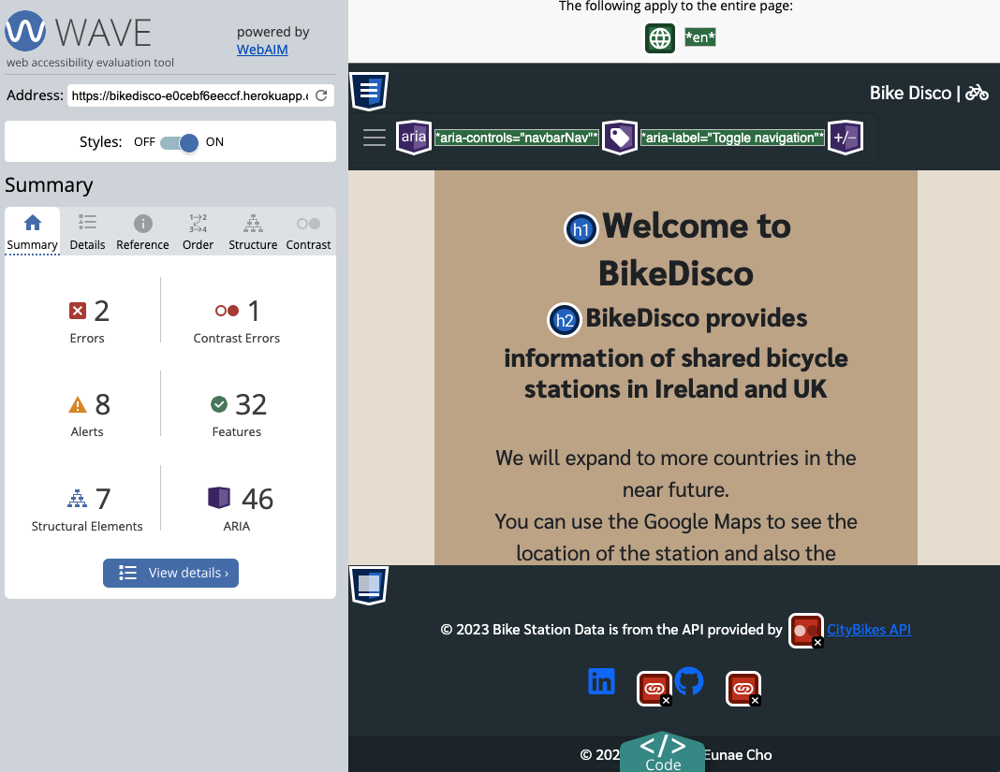

# BikeDisco


# About

BikeDisco is a public bicycle station application that provides station locations and available number of bicycles on real time across Ireland and UK. Station information is all from [CityBike API](https://api.citybik.es/v2/#net_resource). User can join the website, review specific stations and contact us for feedback and improvements.

# Project Goals
- Give users real time information about the bicycle station in Ireland and UK.
- Enable users to write a review about specific stations and also view other reviews that were written by other users. 

## User Goal
- View into the shared bicycle stations in Ireland and UK on Google Maps.
- Create a review of each stations.
- Edit a review that has been created by themselves. 
- View other reviews that were posted by others.
- Delete their own reviews. 
- Join the website as a member. 
- Update their personal data such as name, email address, phone number etc. 
- Delete their account.
- Contact to the admin by filling out the given form.


# User Experience
## Target Audience
- People who likes to use the shared bicycle in Ireland and UK. 
- People who wants to know the real time information of bicycle stations in Ireland and UK.
- People who wants read/share experience after using the shared bicycle station. 

## User Expectations
- Application showing clear purpose.
- Easy interface that allows quick and efficient navigation.
- Interact with other users by writing reviews and also adding comments on the reviews.

## User Stories

1. As a site user I want the navigation to be intuitive and user friendly so that I can navigate the app easily
2. As a site user I want to navigate through the Google Maps so that I can check the location of the bicycle station in Ireland and UK.
3. As a site user I want to check the avaiable number of bicycles on Google Maps info window.
4. As a site user I can join the website as an authenticated user. 
5. As a site user I can access Contact page so that I can contact the admin to provide my opinion or feedback of the website. 
6. As a site user I can access Reviews page so that I can read the reviews that were posted by authenticated users. 
7. As an authenticated user I can write review so that I can share my thoughts of the bicycle stations. 
8. As an authenticated user and a review author I can edit/delete the review that I have posted so that I can amend my reviews.
9. As an authenticated user I can login to the website. 
10. As an authenticated user I can write comments on the posted review modal so that I can share my thoughts of the review. 
11. As an authenticated user and a comment writter I can delete my comment so that I can remove my thoughts about the review.
12. As an authenticated user I can access Profile page so that I can check my ID, email address, first name, last name and phone number. 
13. As an authenticated user I can access edit from Profile page so that I can change my first name, last name, email and phone number. 
14. As an authenticated user I can access Logout page so that I can log out from the site. 

## Site Owner Stories

1. As a site owner I can restrict sections of apps to unauthenticated users so that I can meet the basic data protection standards.
2. As a site owner I would like the authenticated users to have full access on using the apps on the website.
3. As a site owner I would like the site users to submit a contact form so that I can get feedbacks of the website.
4. As a site owner I would like that authenticated users have full access to CRUD(Create, Read, Update, Delete) functionalities when using the website. 


## Project Structure

### HOME PAGE

- Home page should be easy to understand what the website is going to service. It should have the below assets.

**Google Maps**

- Google Maps is currently using developer version since I do not have the paid account for using Google Maps API. Still the functions are working it is not a major blocker of using the site. 
- Google Maps that consists the markers for the shared bike stations. 
- Google maps is the main asset for the home page.
- When the user clicks the station marker, the marker should show the info window that contains the name of the station and the available bike numbers.
- On the info window the user could click on a button to write a review of the station.
- If unauthenticated user clicks the 'write review' button they will be brought to sign in page.

**Top Link Bar**

- On the top-left hand side, the title of the website should be placed. The title links to the homepage.
- On the top-right hand side, the link bar should be placed. Link bar menu should look slightly different to the users between unauthenticated and authenticated.
- As an unauthenticated user, the menu bar should have home, review, login, join and contact.
- As an authenticated user, the menu bar should have home, review, my page, logout and contact.

### REVIEWS

- Reviews page will have every reviews written by registered users. The reviews will be shown in a descending order (new one first).
- When the user clicks the review, the full review will be shown on a modal.


### PROFILE

- Profile is for registered users only. They could view their data such as user id, name, email address, phone number. They could edit their data and also delete their account. 


### CONTACT

- Contact page will be the page for the user to contact the admin of the website to provide feedback or questions. 
- Anyone could write this form. 
- The actual email sending function is not implemented yet since this project is not aiming for that, but the submitted form will be sent to the database and admin will be able to read it. 
- Also the users will still get the alert message that saying 'Thank you for contacting us. We will get back to you soon.'

### Join (Sign up), Login, Logout

- Joining the website as an authenticated user, login and logout features are all part of django-allauth library. The templates are under templates > account > login.html, logout.html and signup.html. These files are using extends function from my base.html to match with the main design of the website. 
- Steps to add django-allauth templates

    1. Install django allauth by entering the line on the terminal: `pip3 install django-allauth`
    2. Update my requirements.txt: pip3 `freeze --local > requirements.txt`
    3. Add the allauth url on bikedisco > urls.py
        `path('accounts/', include('allauth.urls')),`
    4. Go to settings.py and add allauth apps on INSTALLED_APPS

        `'django.contrib.sites',
        'allauth',
        'allauth.account',
        'allauth.socialaccount',`
    5. Set `SITE_ID = 1`
    6. Add redirection urls so that after user logged in all logged out site will redirect to the home page

       ` LOGIN_REDIRECT_URL = '/'
        LOGOUT_REDIRECT_URL = '/'`
    7. To prevent 500 errors during login and registertion add, 
        `ACCOUNT_EMAIL_VERIFICATION = 'none'`

    8. Migrate to the database 


## Code Structure

Project code structure is organised according to the various application using Django Framework. However, every html template is stored all together under templates > main folder.

- Bikedisco App: Serves as the basic structure delivery, aka home app. It consists settings.py for the project, and urls.py for the homepage and includes all other app urls. It also handles the error page as well.

- Contactus App: This app is for users to send a feedback or their opinion of the project to the site owner. It contains the model for Contact, form and views to see the Contact form.

- Profile App: This app is for the authenticated users to manage their account. It has the CRUD functionality for the users to read, update and delete their account. 

- Review App: This app contains full CRUD functionality for adding reviews and comments for authenticated user. It has two models; Post and Comment. Authenticated users can create, read, update and delete a review. Also they can create, read and delete comments.

## Other Django Apps

- settings.py: Contains all configuration settings for my Django project. 
- Procfile: Specify the commands that should be executed when Django app is deployed on the hosting service. 
- static: css and js file is stored as well as the image files for the readme file. 
- requirements.txt: Lists all the dependencies required for the Django project to run. 
- env.py: Sensitive data such as API keys and SECRET key are stored here. My Google Maps API KEY is also stored here so that it would not be revealed even on the base.html code so that it could prevent potential attackers not fetch it from the developer's page.

# CRUD Functionality 

## Review

Authenticated user has full CRUD functionality available for the review. User can write the review, read the review, edit the review and last but not least delete the review. 

### Create

Authenticated user can write review by clicking 'write review' from the top menu bar. 

Once they submit, an alert message will let them know your review has been added. 

<details>
<summary>See Create Review GIF</summary>


</details>

<details>
<summary>See Review Submit Popup Screenshot</summary>


</details>

### Read

Authenticated user can read their review also other reviews that have been posted by other authenticated users. 

<details>
<summary>See Read Review GIF</summary>


</details>

<details>
<summary>See Read Review Screenshot</summary>


</details>


### Update

Authenticated user can update/edit their own reviews. 


<details>
<summary>See Edit Review GIF</summary>


</details>

<details>
<summary>See Edit Review Popup Screenshot</summary>


</details>

### Delete

Authenticated user can delete their review. 

<details>
<summary>See Review Delete GIF</summary>


</details>

<details>
<summary>See Delete Review Popup</summary>


</details>


## Comment

Authenticated user can write, read and delele comments. 

#### Create

Authenticated user can write a comment on the review modal. 

<details>
<summary>See Post Comment GIF</summary>


</details>


#### Read 

User can read comments on a review modal by clicking on the 'Read full review' on Reviews page. 

<details>
<summary>See Read Comment Screenshot</summary>


</details>


#### Delete

Comment writter can delete their comments. Only the comment writter will be able to see the trashcan icon next to their own comment on the review modal.

<details>
<summary>See delete comment GIF</summary>


</details>


<details>
<summary>See delete comment popup screenshot</summary>


</details>


## Profile

User can create, read, update and delete their account.

#### Create

<details>
<summary>See Profile Create</summary>


</details>

#### Read

<details>
<summary>See Profile Read</summary>


</details>

#### Update

<details>
<summary>See Profile Edit</summary>


</details>

#### Delete

<details>
<summary>See Profile Delete</summary>


</details>

<details>
<summary>See Profile After Delete</summary>


</details>


# Design

## Color Scheme
Used light brown colour on the background to reduce stressed eye and dark theme on the nav and the footer for better visibility on the main content. 
Color scheme is from [Coolor](https://coolors.co/)

<details>
<summary>See Color Palette</summary>


</details>

## Font 

Using 'Sarabun' supplied by Google Font and sans-serif as a backup when the browser is not supporting Sarabun.

<details>
<summary>See font</summary>


</details>


# Database

## Data Models

5 models are used for each apps. 

### User Model
- User model is from Django allauth library and it contains basic information about authenticated user. 

### Post Model

- Post model is used for each review uploaded by the user. It has a foreign key for author which is extended by User model. It uses slug field to create a unique id for each review. Also country, city and the station_name data is fetched from the CityBike API which will be used to populate a dropdown menu for the user to select the station info when posting a review.

| Name | Field Type | Validation |
| :---:   | :---: | :---: |
| title | CharField | max_length=200, unique=True |
slug | SlugField | max_length=200, unique=True |
author | ForeignKey | on_delete=models.CASCADE, related_name="review_posts" |
updated_on | DateTimeField | auto_now=True |
content | TextField | |
featured_image | CloudinaryField | 'image', default='placeholder' |
created_on | DateTimeField | auto_now_add=True |
status | IntegerField | choices=STATUS, default=1 |
country | CharField | max_length=100, null=True |
city | CharField | max_length=100, null=True |
station_name | CharField | max_length=100, null=True |


### Comment Model

- Comment model is used for comments on each review modal. Two foreign key; post and user is used to be linked with the Post and User models. 

| Name | Field Type | Validation |
| :---:   | :---: | :---: |
| post | ForeignKey | Post, on_delete=models.CASCADE, related_name='comment' |
| user | ForeignKey | User, on_delete=models.CASCADE, related_name='commentuser', null=True |
| comment | TextField | |
| created_on | DataTimeField | auto_now_add=True |

### Profile Model

- Profile model is used for authenticated user's profile data. 

| Name | Field Type | Validation |
| :---:   | :---: | :---: |
user | OneToOneField | on_delete=models.CASCADE, related_name='profile' |
firstname | CharField | max_length=50, blank=True, Default = 'Enter your first name' |
lastname | CharField | max_length=50, blank=True, Default = 'Enter your first name' |
phone_number | PhoneNumberField | blank=True |
email | EmailField | |

### Contact Model

- Contact Model is used to populate the Contact form on Contact model. These data will be stored in our database when the user submits the contact form. 

| Name | Field Type | Validation |
| :---:   | :---: | :---: |
name | CharField | max_length=100 |
email | EmailField | |
subject | TextField | |


## API

### CityBike API

- The main content which is providing real time data and location of the bicycle stations is coming from CityBike API. This API is a free service providing shared bicycle station data across various of countries. URL for each city could be found at the href on the API. See the steps taken to get the URL for each city with the below example.

1. Go to http://api.citybik.es/v2/networks
2. Search for the city name that you want to use (e.g. Cork)
3. Check the href of that city. (e.g. "href":"/v2/networks/cork")
4. Copy the href and add it on the end of the main URL (e.g. http://api.citybik.es/v2/networks/v2/networks/cork)
5. Access the above URL and copy/paste it on the beautify website to navigate into the API (e.g. [JSON Formatter](https://jsonformatter.org/))


### Google Maps API

- This project is using Google Maps JavaScript API. My API code is being hidden in the env.py file and will not be sent over to Github since I have added the env.py file to be ignored (.gitignore).  
- Google Maps are not paid version so it will show unwanted water marks on the background of the map and a popup message on the top. Despite that, all the expected functions that I have implemented are working well; such as importing bicycle station markers, showing info window on each marker and getting clustered when the map is zoomed out.

# Agile Methodologies

## Kanban


# Testing


# Validation

## HTML

- Conduncted every HTML codes on [The W3C Markup Validation Service](https://validator.w3.org/#validate_by_input)

- Ignored all error messages related about missing !DOCTYPE on the top since we are loading static.

- Every other errors were parse error related with Django template and Jinja2 so they were ignored as well.


## JavaScript

- Conducted [JShint](https://jshint.com/) validation check for script.js codes.


- Fixed serveral missing semicolon issues.

- Two warnings 
    - These will not be fixed since they are related with Google Maps JavaScript code. 
```
86	Functions declared within loops referencing an outer scoped variable may lead to confusing semantics. (map, marker, buttonId, targetUrl)
103	Do not use 'new' for side effects.
```

- Three undefined variables
    - These will not be fixed neither, since `google` and `MarkerClusterer` is both from Google Maps JavaScript code. 
    - `targetUrl` is under serachstation.html script, so will not be fixed in script.js file.
```
53	google
67	google
82	google
92	targetUrl
213	targetUrl
103	MarkerClusterer
```

## Python

- Conducted all py files on [CI Python Linter](https://pep8ci.herokuapp.com/)

- No errors were found. 


## WAVE (Accessibility check)

WAVE is a suite of evaluation tools that helps the web content more accessible to inviduals with disabilities. 

There were some issues spotted on the first check.

<details>
<summary>Home</summary>


</details>

- 2 Errors: Empty Link. Icon links on the footer that links to my Linkedin and Github doesn't contain text which would make the screen reader with no info. 
    - Fixed by adding `aria-hidden` and `.sr-only ` 

- 1 Contrast Error: Very low contrast. Link text color to CityBike API on the footer had a very low contrast between text and the background color. 
    - Fixed by changing the text color to white. 


# Deployment 


## Credits and References

- [CityBikes API Documentation](https://api.citybik.es/v2/#net_resource)
- jQuery
- [Google Maps API](https://developers.google.com/maps/documentation/javascript)
- [Bootstrap 5.3.1](https://getbootstrap.com/docs/5.3/)
- [Django](https://www.djangoproject.com/)
    - [Django Allauto](https://django-allauth.readthedocs.io/en/latest/)
    - [django-active-link](https://valerymelou.com/blog/2020-05-04-how-to-highlight-active-links-in-your-django-website)
- [Google Font](https://fonts.google.com/)
- [Fontawesome](https://fontawesome.com/)
- [Stackoverflow](https://stackoverflow.com/) for browsing related questions